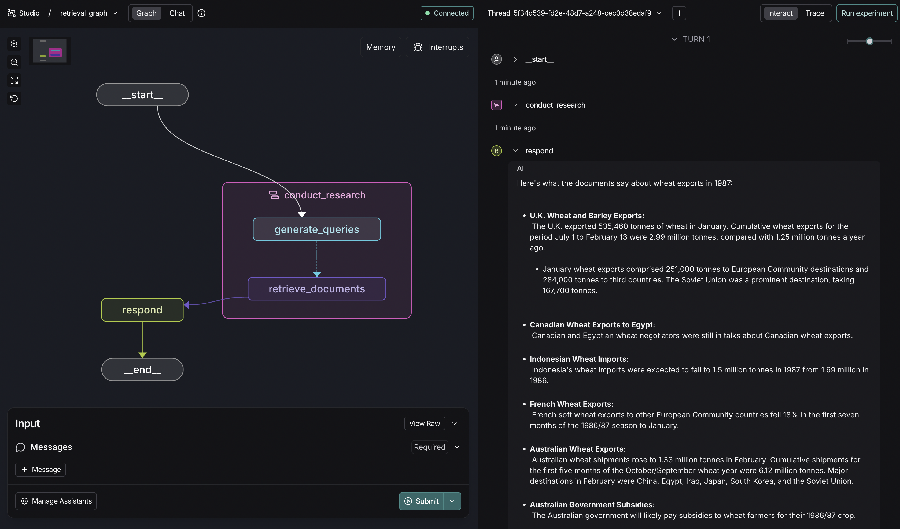

# LangGraph RAG Research Agent Template

[](https://github.com/langchain-ai/rag-research-agent-template/actions/workflows/unit-tests.yml)
[](https://github.com/langchain-ai/rag-research-agent-template/actions/workflows/integration-tests.yml)

[![Open in - LangGraph Studio](https://img.shields.io/badge/Open_in-LangGraph_Studio-00324d.svg?logo=data:image/svg%2bxml;base64,PHN2ZyB4bWxucz0iaHR0cDovL3d3dy53My5vcmcvMjAwMC9zdmciIHdpZHRoPSI4NS4zMzMiIGhlaWdodD0iODUuMzMzIiB2ZXJzaW9uPSIxLjAiIHZpZXdCb3g9IjAgMCA2NCA2NCI+PHBhdGggZD0iTTEzIDcuOGMtNi4zIDMuMS03LjEgNi4zLTYuOCAyNS43LjQgMjQuNi4zIDI0LjUgMjUuOSAyNC41QzU3LjUgNTggNTggNTcuNSA1OCAzMi4zIDU4IDcuMyA1Ni43IDYgMzIgNmMtMTIuOCAwLTE2LjEuMy0xOSAxLjhtMzcuNiAxNi42YzIuOCAyLjggMy40IDQuMiAzLjQgNy42cy0uNiA0LjgtMy40IDcuNkw0Ny4yIDQzSDE2LjhsLTMuNC0zLjRjLTQuOC00LjgtNC44LTEwLjQgMC0xNS4ybDMuNC0zLjRoMzAuNHoiLz48cGF0aCBkPSJNMTguOSAyNS42Yy0xLjEgMS4zLTEgMS43LjQgMi41LjkuNiAxLjcgMS44IDEuNyAyLjcgMCAxIC43IDIuOCAxLjYgNC4xIDEuNCAxLjkgMS40IDIuNS4zIDMuMi0xIC42LS42LjkgMS40LjkgMS41IDAgMi43LS41IDIuNy0xIDAtLjYgMS4xLS44IDIuNi0uNGwyLjYuNy0xLjgtMi45Yy01LjktOS4zLTkuNC0xMi4zLTExLjUtOS44TTM5IDI2YzAgMS4xLS45IDIuNS0yIDMuMi0yLjQgMS41LTIuNiAzLjQtLjUgNC4yLjguMyAyIDEuNyAyLjUgMy4xLjYgMS41IDEuNCAyLjMgMiAyIDEuNS0uOSAxLjItMy41LS40LTMuNS0yLjEgMC0yLjgtMi44LS44LTMuMyAxLjYtLjQgMS42LS41IDAtLjYtMS4xLS4xLTEuNS0uNi0xLjItMS42LjctMS43IDMuMy0yLjEgMy41LS41LjEuNS4yIDEuNi4zIDIuMiAwIC43LjkgMS40IDEuOSAxLjYgMi4xLjQgMi4zLTIuMy4yLTMuMi0uOC0uMy0yLTEuNy0yLjUtMy4xLTEuMS0zLTMtMy4zLTMtLjUiLz48L3N2Zz4=)](https://langgraph-studio.vercel.app/templates/open?githubUrl=https://github.com/langchain-ai/rag-research-agent-template)

This is a starter project to help you get started with developing a RAG research agent using [LangGraph](https://github.com/langchain-ai/langgraph) in [LangGraph Studio](https://github.com/langchain-ai/langgraph-studio).



## What it does

This project has three graphs:

* an "index" graph (`src/index_graph/graph.py`)
* a "retrieval" graph (`src/retrieval_graph/graph.py`)
* a "researcher" subgraph (part of the retrieval graph) (`src/retrieval_graph/researcher_graph/graph.py`)

The index graph takes in document objects indexes them.

```json
[{ "page_content": "LangGraph is a library for building stateful, multi-actor applications with LLMs, used to create agent and multi-agent workflows." }]
```

If an empty list is provided (default), a list of sample documents from `src/sample_docs.json` is indexed instead. Those sample documents are based on the conceptual guides for LangChain and LangGraph.

The retrieval graph manages a chat history and responds based on the fetched documents. Specifically, it:

1. Takes a user **query** as input
2. Analyzes the query and determines how to route it:
- if the query is about "LangChain", it creates a research plan based on the user's query and passes the plan to the researcher subgraph
- if the query is ambiguous, it asks for more information
- if the query is general (unrelated to LangChain), it lets the user know
3. If the query is about "LangChain", the researcher subgraph runs for each step in the research plan, until no more steps are left:
- it first generates a list of queries based on the step
- it then retrieves the relevant documents in parallel for all queries and return the documents to the retrieval graph
4. Finally, the retrieval graph generates a response based on the retrieved documents and the conversation context

## Getting Started

Assuming you have already [installed LangGraph Studio](https://github.com/langchain-ai/langgraph-studio?tab=readme-ov-file#download), to set up:

1. Create a `.env` file.

```bash
cp .env.example .env
```

2. Select your retriever & index, and save the access instructions to your `.env` file.

<!--
Setup instruction auto-generated by `langgraph template lock`. DO NOT EDIT MANUALLY.
-->

### Setup Retriever

The defaults values for `retriever_provider` are shown below:

```yaml
retriever_provider: qdrant
```

Follow the instructions below to get set up, or pick one of the additional options.

#### Qdrant

Qdrant is a fast vectordb. It has an extensive support for metadata filtering.
To start a docker container for Qdrant run:
```
docker run -p 6333:6333 -p 6334:6334 \
  -v $(pwd)/qdrant_storage:/qdrant/storage:z \
  qdrant/qdrant
```

### Setup Model

The defaults values for `response_model`, `query_model` are shown below:

```yaml
response_model: google_genai/gemini-2.0-flash-lite
query_model: google_genai/gemini-2.0-flash-lite
```

Follow the instructions below to get set up, or pick one of the additional options.

#### OpenAI

To use Google Gemini's chat models:

1. Sign up for an [Google AI Studio API key](https://aistudio.google.com/).
2. Once you have your API key, add it to your `.env` file:
```
GOOGLE_API_KEY=your-api-key
```


### Setup Embedding Model

The defaults values for `embedding_model` are shown below:

```yaml
embedding_model: openai/text-embedding-3-small
```

Follow the instructions below to get set up, or pick one of the additional options.

#### OpenAI

To use OpenAI's embeddings:

1. Sign up for an [OpenAI API key](https://platform.openai.com/signup).
2. Once you have your API key, add it to your `.env` file:
```
OPENAI_API_KEY=your-api-key
```

#### Cohere

To use Cohere's embeddings:

1. Sign up for a [Cohere API key](https://dashboard.cohere.com/welcome/register).
2. Once you have your API key, add it to your `.env` file:

```bash
COHERE_API_KEY=your-api-key
```


<!--
End setup instructions
-->

## Using

Once you've set up your retriever and saved your model secrets, it's time to try it out! First, let's add some information to the index. Open studio, select the "indexer" graph from the dropdown in the top-left, and then add some content to chat over. You can just invoke it with an empty list (default) to index sample documents from LangChain and LangGraph documentation.

You'll know that the indexing is complete when the indexer "delete"'s the content from its graph memory (since it's been persisted in your configured storage provider).

Next, open the "retrieval_graph" using the dropdown in the top-left. Ask it questions about LangChain to confirm it can fetch the required information!

## How to customize

You can customize this retrieval agent template in several ways:

1. **Modify the embedding model**: You can change the embedding model used for document indexing and query embedding by updating the `embedding_model` in the configuration. Options include various fastembed models.

2. **Customize the response generation**: You can modify the `response_system_prompt` to change how the agent formulates its responses. This allows you to adjust the agent's personality or add specific instructions for answer generation.

3. **Change the language model**: Update the `response_model` in the configuration to use different language models for response generation. Options include various Claude models from Anthropic, as well as models from other providers like Fireworks AI.

4. **Extend the graph**: You can add new nodes or modify existing ones in the `src/retrieval_graph/graph.py` file to introduce additional processing steps or decision points in the agent's workflow.

5. **Add tools**: Implement tools to expand the researcher agent's capabilities beyond simple retrieval generation.

Remember to test your changes thoroughly to ensure they improve the agent's performance for your specific use case.

## Development

While iterating on your graph, you can edit past state and rerun your app from past states to debug specific nodes. Local changes will be automatically applied via hot reload. Try adding an interrupt before the agent calls the researcher subgraph, updating the default system message in `src/retrieval_graph/prompts.py` to take on a persona, or adding additional nodes and edges!

Follow up requests will be appended to the same thread. You can create an entirely new thread, clearing previous history, using the `+` button in the top right.

You can find the latest (under construction) docs on [LangGraph](https://github.com/langchain-ai/langgraph) here, including examples and other references. Using those guides can help you pick the right patterns to adapt here for your use case.

LangGraph Studio also integrates with [LangSmith](https://smith.langchain.com/) for more in-depth tracing and collaboration with teammates.
